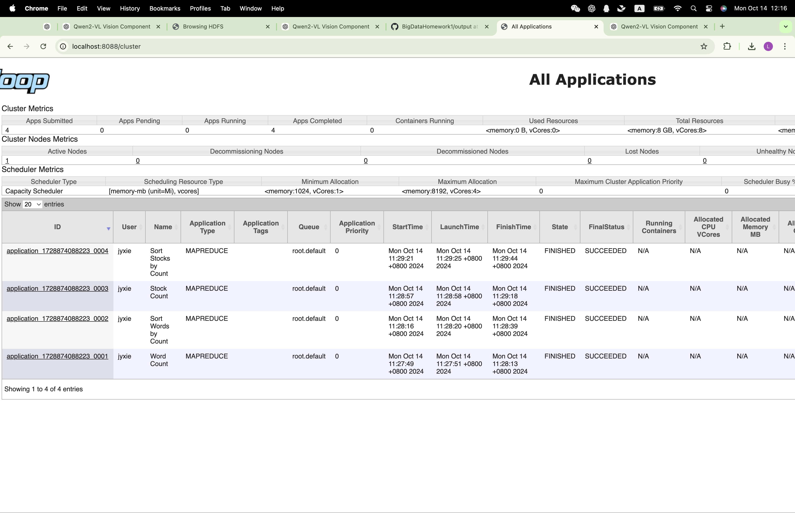

# I.设计思路

## 任务1：统计股票代码出现次数
1. Mapper：
使用StockCountMapper，解析输入文件的每一行，提取第四个字段stock,输出<股票代码,1>。
2. CombinerandReducer:
都使用StockCountReducer，接收每个股票代码对应的value,汇总每个股票代码的总出现次数，输出<股票代码,总次数>。
3. 排序:
使用SortByCountMapper和SortByCountReducer，将<股票代码,总次数>反转为<总次数,股票代码>，按总次数降序排序。

## 任务2：统计高频单词
1. Mapper:
使用WordCountMapper，解析输入文件的每一行，提取第二个字段headline，去除标点符号，转换为小写并过滤停用词，最后分割成多个单词，分别输出<单词,1>。
2. Combiner and Reducer:
都使用WordCountReducer，接收每个单词对应的value，汇总每个单词的总出现次数，输出<单词,总次数>。
3. 排序:
使用SortByCountMapper和SortByCountReducerLimited，将<单词,总次数>反转为<总次数,单词>，按总次数降序排序，输出前100个。

# II.程序运行结果
依次运行：

hadoop jar target/MapReduceHomework-1.0-SNAPSHOT.jar /user/jyxie/input/analyst_ratings.csv /user/jyxie/output/temp_task1 /user/jyxie/output/final_task1 /user/jyxie/input/stop-word-list.txt task1

hadoop jar target/MapReduceHomework-1.0-SNAPSHOT.jar /user/jyxie/input/analyst_ratings.csv /user/jyxie/output/temp_task2 /user/jyxie/output/final_task2 /user/jyxie/input/stop-word-list.txt task2

运行成功的web截图： 
输出见output目录下文件

# III.不足与改进之处
1. 使用了临时输出路径，需要用户提供，用户使用不当容易出现错误，可以更改为根据时间戳自动生成，并在使用后及时删除
2. 可以增加更加详细的日志代码，在出现问题时便于调试
3. 没有验证输出路径是否研究存在，可以添加相关的处理